# 🐦 Sparrow Chat Application - Architecture Report

**Version:** 2.0  
**Date:** January 2024  
**Author:** Development Team  
**Status:** Production Ready

---

## Executive Summary

Sparrow is a modern, full-stack real-time chat application designed for secure, scalable messaging. Built with React, Node.js, MongoDB, and Socket.IO, it provides enterprise-grade security through AWS KMS encryption, multiple authentication methods, and real-time communication capabilities.

### Key Features

- **Real-time Messaging**: Instant message delivery with read receipts
- **Multi-Authentication**: Email/phone registration and Google OAuth
- **End-to-End Encryption**: AWS KMS envelope encryption for message security
- **Social Features**: Friend management and global user search
- **Modern UI**: Responsive design with notification system
- **Scalable Architecture**: Cloud-native deployment with auto-scaling

---

## 1. System Overview

### 1.1 Application Architecture

Sparrow follows a modern microservices-inspired architecture with clear separation of concerns:

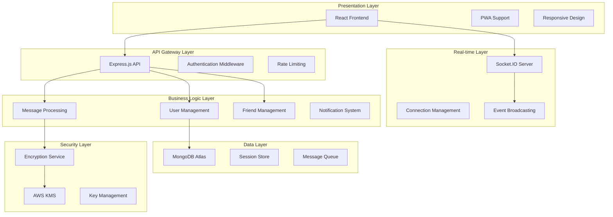

### 1.2 Technology Stack

| Layer              | Technology                          | Purpose                               |
| ------------------ | ----------------------------------- | ------------------------------------- |
| **Frontend**       | React 19, React Router, Bootstrap 5 | User interface and navigation         |
| **Backend**        | Node.js, Express.js                 | API server and business logic         |
| **Real-time**      | Socket.IO                           | WebSocket communication               |
| **Database**       | MongoDB Atlas                       | Data persistence and session storage  |
| **Authentication** | Express-session, JWT, Google OAuth  | User authentication and authorization |
| **Encryption**     | AWS KMS, AES-256-GCM                | Message encryption and key management |
| **Deployment**     | AWS Elastic Beanstalk, Vercel       | Cloud hosting and CDN                 |
| **Monitoring**     | Custom logging, Health checks       | Application monitoring                |

---

## 2. Frontend Architecture

### 2.1 Component Structure

The React frontend is organized using a component-based architecture with context providers for state management:

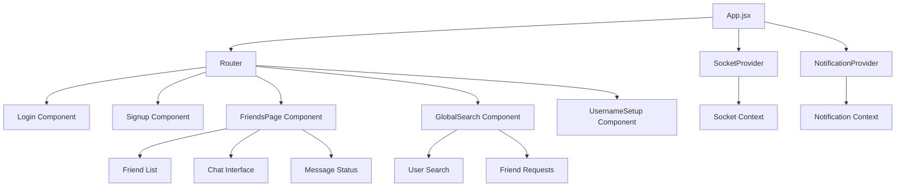

### 2.2 State Management

The application uses React Context API for global state management:

- **SocketContext**: Manages WebSocket connections and real-time events
- **NotificationContext**: Handles browser notifications and alerts
- **Local Storage**: Persists user session data across browser sessions

### 2.3 Real-time Communication

The frontend establishes a persistent WebSocket connection for real-time features:

```javascript
// Socket connection management
const SocketProvider = ({ children }) => {
  const [socket, setSocket] = useState(null);
  const [isConnected, setIsConnected] = useState(false);

  useEffect(() => {
    const newSocket = io(process.env.REACT_APP_BACKEND_URL);
    setSocket(newSocket);

    newSocket.on("connect", () => {
      setIsConnected(true);
      // Register user with socket
      newSocket.emit("register", profileId);
    });
  }, []);
};
```

---

## 3. Backend Architecture

### 3.1 Server Structure

The Node.js backend follows a layered architecture pattern:

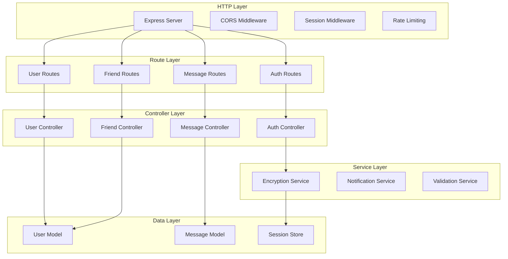

### 3.2 API Design

The RESTful API follows REST principles with clear resource-based URLs:

| Endpoint                  | Method | Purpose             | Authentication |
| ------------------------- | ------ | ------------------- | -------------- |
| `/api/auth/register`      | POST   | User registration   | None           |
| `/api/auth/login`         | POST   | User login          | None           |
| `/api/auth/logout`        | POST   | User logout         | Session        |
| `/api/user`               | GET    | Get user profile    | Session        |
| `/api/friends`            | GET    | Get friends list    | Session        |
| `/api/friends/request`    | POST   | Send friend request | Session        |
| `/api/messages/:friendId` | GET    | Get messages        | Session        |
| `/api/messages`           | POST   | Send message        | Session        |

### 3.3 Authentication System

The application implements a hybrid authentication system:

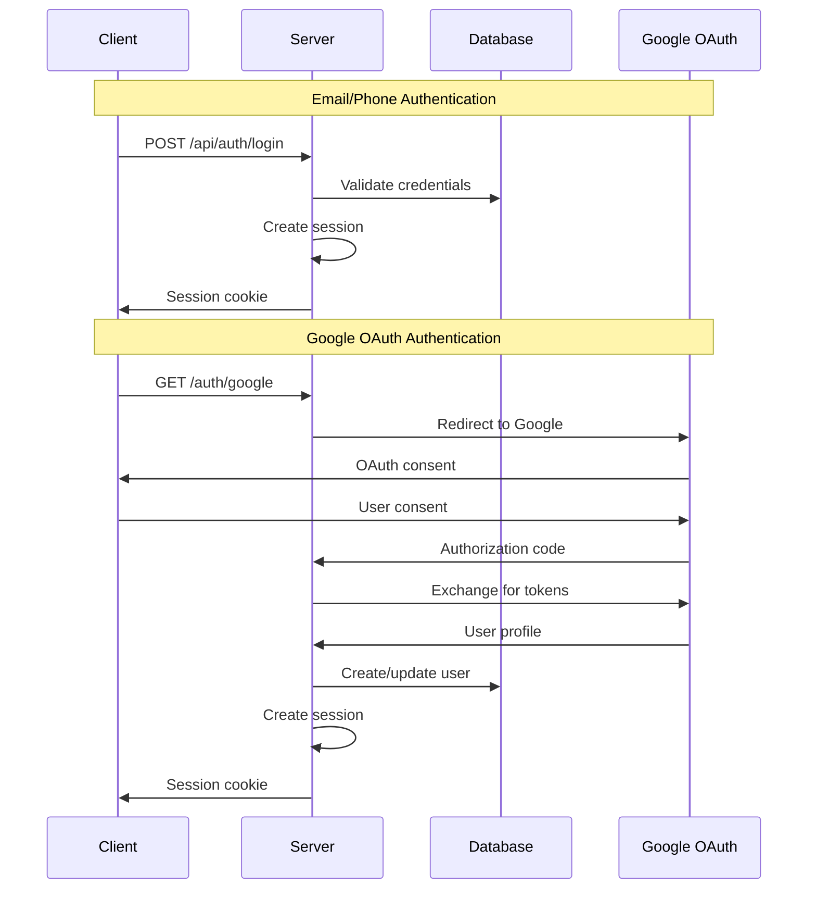

---

## 4. Database Architecture

### 4.1 Data Model Design

The MongoDB database uses a document-based schema optimized for chat applications:

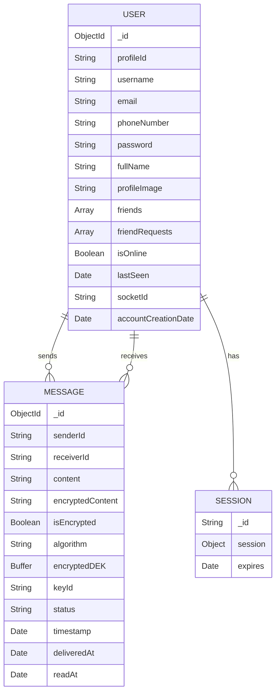

### 4.2 Indexing Strategy

Optimized indexes for performance:

```javascript
// User collection indexes
db.users.createIndex({ profileId: 1 }, { unique: true });
db.users.createIndex({ email: 1 }, { unique: true, sparse: true });
db.users.createIndex({ username: 1 }, { unique: true });
db.users.createIndex({ isOnline: 1, lastSeen: -1 });

// Message collection indexes
db.messages.createIndex({ senderId: 1, receiverId: 1, timestamp: -1 });
db.messages.createIndex({ receiverId: 1, status: 1 });
db.messages.createIndex({ isEncrypted: 1, sessionId: 1 });
```

### 4.3 Data Flow

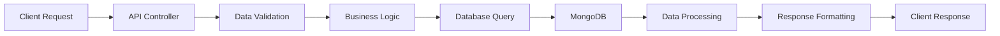

---

## 5. Real-time Communication Architecture

### 5.1 Socket.IO Implementation

The real-time communication system uses Socket.IO for bidirectional communication:

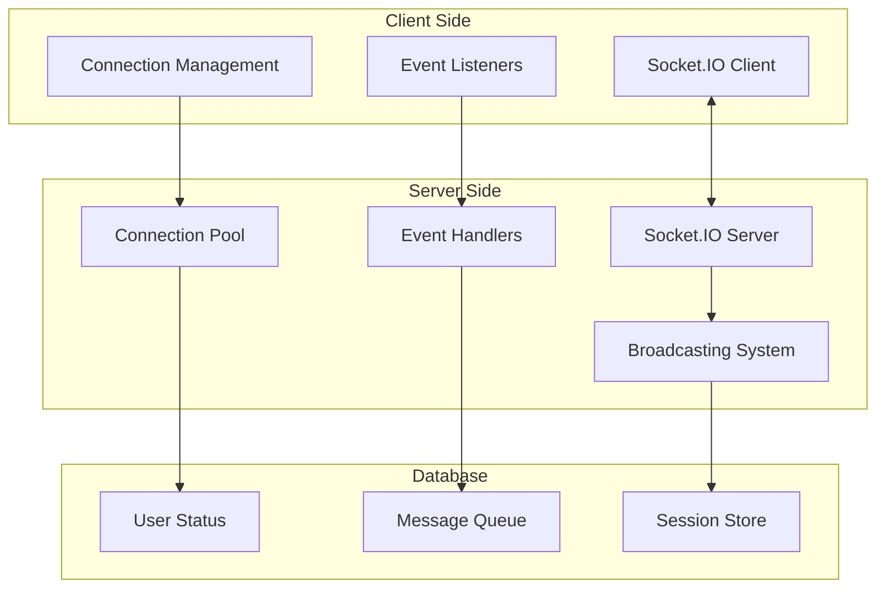

### 5.2 Event System

The application implements a comprehensive event system:

| Event Type                    | Purpose                | Data Flow                |
| ----------------------------- | ---------------------- | ------------------------ |
| `register`                    | User connection        | Client → Server          |
| `sendMessage`                 | Message transmission   | Client → Server → Client |
| `receiveMessage`              | Message delivery       | Server → Client          |
| `friendOnlineStatus`          | Presence updates       | Server → Client          |
| `messageStatusUpdate`         | Delivery confirmations | Server → Client          |
| `messageReceivedNotification` | Push notifications     | Server → Client          |

### 5.3 Connection Management

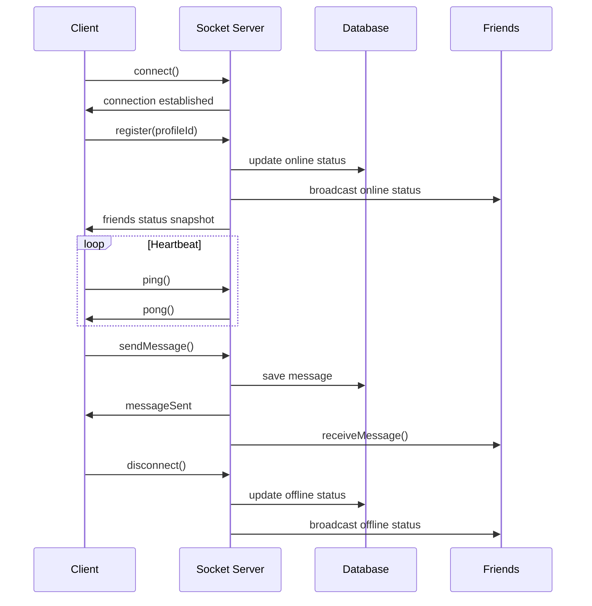

---

## 6. Security Architecture

### 6.1 Encryption System

The application implements a multi-layered encryption system:

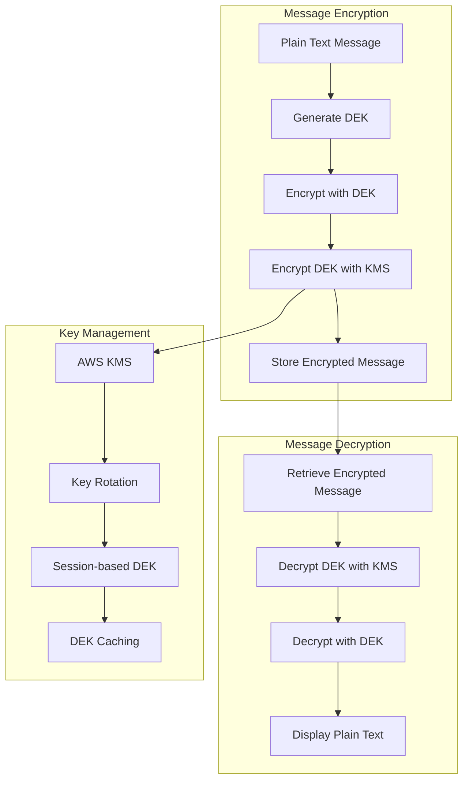

### 6.2 Authentication Security

```mermaid
graph TB
    subgraph "Session Security"
        A[HttpOnly Cookies]
        B[Secure Flag]
        C[SameSite Protection]
        D[Session Rotation]
    end

    subgraph "Password Security"
        E[Bcrypt Hashing]
        F[Salt Rounds]
        G[Account Lockout]
        H[Password History]
    end

    subgraph "OAuth Security"
        I[OpenID Connect]
        J[State Validation]
        K[PKCE Implementation]
        L[Token Exchange]
    end

    A --> B
    B --> C
    C --> D
    E --> F
    F --> G
    G --> H
    I --> J
    J --> K
    K --> L
```

### 6.3 Data Protection

- **Encryption at Rest**: MongoDB encryption with AWS KMS
- **Encryption in Transit**: TLS 1.3 for all communications
- **Key Management**: Automated key rotation and secure storage
- **Data Minimization**: Messages deleted after delivery
- **Access Control**: Role-based permissions and session management

---

## 7. Performance Architecture

### 7.1 Scalability Design

The application is designed for horizontal scaling:

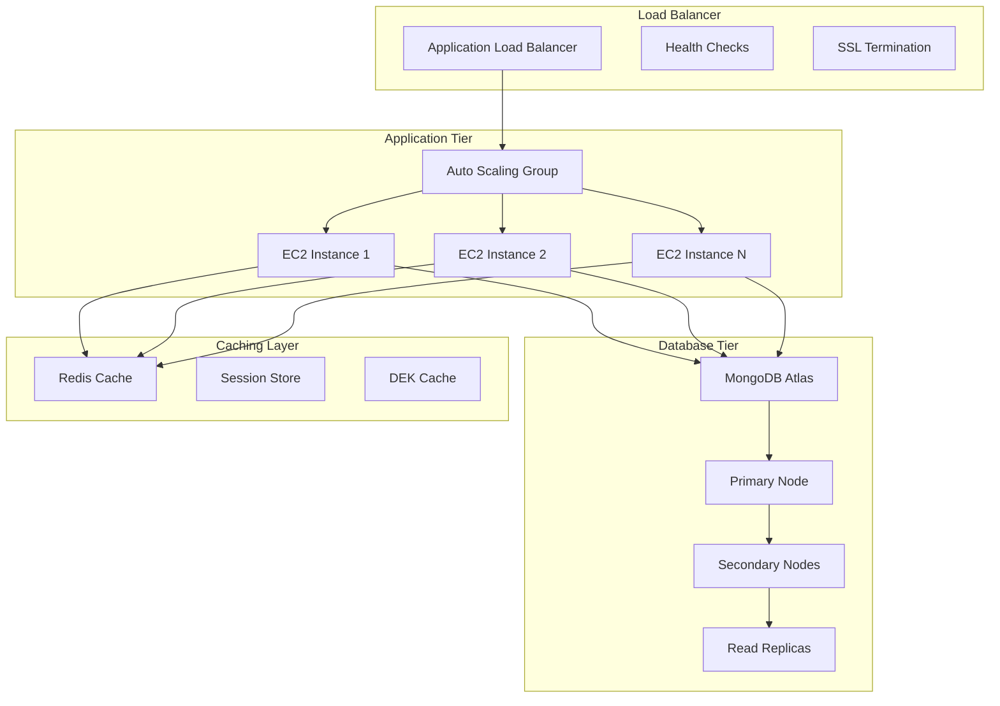

### 7.2 Performance Optimizations

1. **Database Optimizations**

   - Compound indexes for common queries
   - Connection pooling
   - Query optimization
   - Aggregation pipelines

2. **Caching Strategy**

   - DEK caching for encryption performance
   - Session caching for authentication
   - Connection pooling for Socket.IO

3. **Frontend Optimizations**
   - Code splitting and lazy loading
   - Memoization for expensive operations
   - Virtual scrolling for large lists
   - Image optimization and compression

### 7.3 Monitoring and Metrics

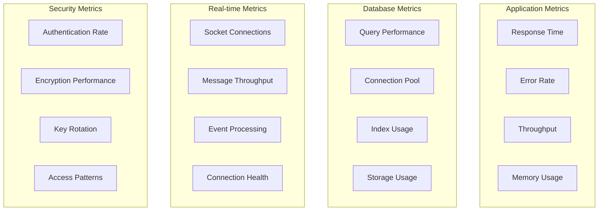

---

## 8. Deployment Architecture

### 8.1 Cloud Infrastructure

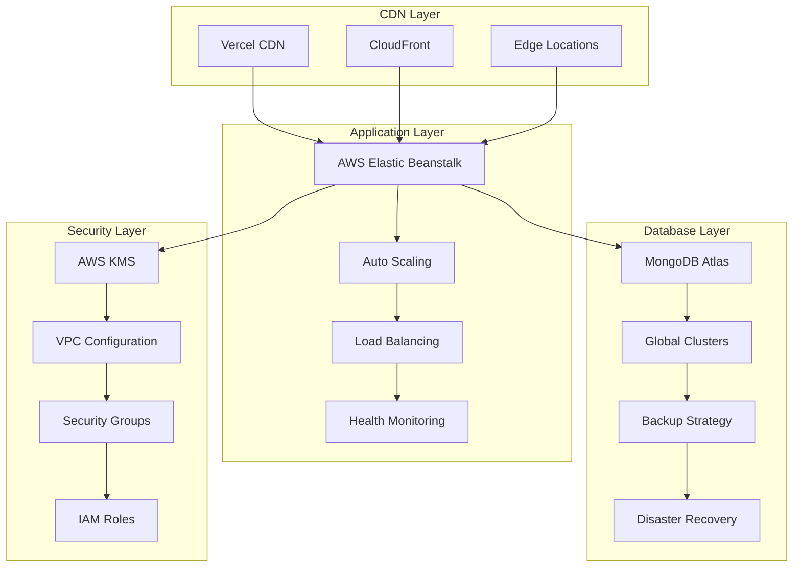

### 8.2 Environment Configuration

#### Production Environment

- **Frontend**: Vercel with global CDN
- **Backend**: AWS Elastic Beanstalk with auto-scaling
- **Database**: MongoDB Atlas with replica sets
- **Security**: AWS KMS for encryption
- **Monitoring**: CloudWatch and custom logging

#### Development Environment

- **Frontend**: React development server
- **Backend**: Node.js with nodemon
- **Database**: Local MongoDB or Atlas sandbox
- **Security**: Development KMS keys

### 8.3 CI/CD Pipeline

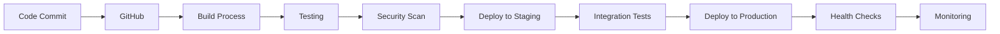

---

## 9. Security and Compliance

### 9.1 Security Measures

1. **Data Encryption**

   - End-to-end message encryption
   - Database encryption at rest
   - TLS 1.3 for all communications
   - Secure key management with AWS KMS

2. **Authentication Security**

   - Multi-factor authentication support
   - Session-based authentication
   - OAuth 2.0 with OpenID Connect
   - Account lockout policies

3. **Network Security**
   - CORS configuration
   - Rate limiting
   - DDoS protection
   - Secure headers

### 9.2 Compliance Framework

- **GDPR Compliance**: Data portability and deletion rights
- **Security Auditing**: Regular security assessments
- **Data Retention**: Configurable retention policies
- **Access Logging**: Comprehensive audit trails

---

## 10. Future Enhancements

### 10.1 Planned Features

1. **Advanced Messaging**

   - File sharing and media messages
   - Message reactions and replies
   - Group chat functionality
   - Message threading

2. **Enhanced Security**

   - End-to-end encryption for all data
   - Advanced threat detection
   - Security incident response
   - Compliance automation

3. **Performance Improvements**
   - Microservices architecture
   - Event-driven architecture
   - Advanced caching strategies
   - Real-time analytics

### 10.2 Scalability Roadmap

1. **Short-term (3-6 months)**

   - Horizontal scaling implementation
   - Database sharding
   - CDN optimization
   - Performance monitoring

2. **Medium-term (6-12 months)**

   - Microservices migration
   - Event streaming
   - Advanced analytics
   - Machine learning integration

3. **Long-term (12+ months)**
   - Global deployment
   - Multi-region architecture
   - Advanced AI features
   - Enterprise integrations

---

## Conclusion

The Sparrow chat application represents a modern, secure, and scalable approach to real-time messaging. With its comprehensive security measures, efficient architecture, and cloud-native deployment, it provides a solid foundation for secure communication while maintaining excellent performance and user experience.

The architecture is designed to scale with growing user demands while maintaining security and reliability. The modular design allows for easy maintenance and future enhancements, ensuring the application remains competitive in the evolving landscape of secure messaging platforms.

---

**Document Version:** 1.0  
**Last Updated:** January 2024  
**Next Review:** April 2024
