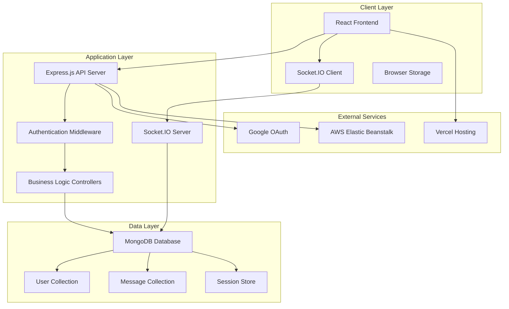

# Sparrow Chat Application
## Professional Project Report

---

**Project:** Sparrow Real-Time Chat Application  
**Author:** Purushothaman R  
**Date:** January 2024  
**Version:** 2.0  

---

## Table of Contents

1. [Project Overview](#project-overview)
2. [Key Features](#key-features)
3. [System Architecture](#system-architecture)
4. [Technology Stack](#technology-stack)
5. [Core Modules](#core-modules)
6. [Security & Deployment](#security--deployment)
7. [Future Improvements](#future-improvements)
8. [Conclusion](#conclusion)

---

## Project Overview

Sparrow is a modern, real-time chat application designed to provide seamless communication between users through a robust, scalable platform. The application serves as a comprehensive messaging solution that combines traditional authentication methods with modern OAuth integration, enabling users to connect, communicate, and maintain relationships in real-time.

The primary objective of Sparrow is to deliver a production-ready chat platform that demonstrates best practices in web application development, including secure authentication, real-time communication, and scalable architecture. The system is built with enterprise-grade security measures and is designed to handle concurrent users while maintaining performance and reliability.

---

## Key Features

• **Dual Authentication System** - Integrated support for traditional email/phone/username login alongside Google OAuth for flexible user onboarding

• **Real-Time Messaging** - Instant message delivery and status tracking (sent, delivered, read) powered by Socket.IO technology

• **Friend Management System** - Complete social networking features including friend requests, acceptance/rejection workflows, and friend removal capabilities

• **Global User Discovery** - Advanced search functionality allowing users to find and connect with other platform members through username-based queries

• **Online Presence Tracking** - Real-time friend online/offline status indicators with last-seen timestamps for enhanced user experience

• **Message Status Indicators** - Comprehensive message delivery tracking with visual indicators for sent, delivered, and read statuses

• **Responsive Modern UI** - Mobile-friendly interface built with React Bootstrap, ensuring consistent experience across all devices

---

## System Architecture

The Sparrow Chat Application follows a three-tier architecture pattern, separating presentation, business logic, and data layers for optimal scalability and maintainability.

The architecture demonstrates a clean separation of concerns where the React frontend communicates with the Express.js backend through RESTful APIs and WebSocket connections. The backend manages authentication, business logic, and data persistence through MongoDB, while external services handle OAuth authentication and cloud hosting.

---

## Technology Stack

| Component | Technology | Version | Purpose |
|-----------|------------|---------|---------|
| **Frontend Framework** | React | 19.0.0 | User interface and state management |
| **Backend Runtime** | Node.js | 16+ | Server-side JavaScript execution |
| **Backend Framework** | Express.js | 4.21.2 | RESTful API development |
| **Database** | MongoDB | 4.4+ | NoSQL document storage |
| **Database ODM** | Mongoose | 8.9.4 | Object modeling and validation |
| **Real-time Communication** | Socket.IO | 4.8.1 | WebSocket-based messaging |
| **Authentication** | Express-session + OIDC | Latest | Session management and OAuth |
| **Password Security** | bcryptjs | 2.4.3 | Password hashing and verification |
| **HTTP Client** | Axios | 1.7.9 | API communication |
| **UI Components** | React Bootstrap | 2.10.7 | Responsive UI components |
| **Routing** | React Router DOM | 7.1.1 | Client-side navigation |
| **Frontend Hosting** | Vercel | Latest | Static site deployment |
| **Backend Hosting** | AWS Elastic Beanstalk | Latest | Scalable application hosting |

---

## Core Modules

### Authentication Module
The authentication system implements a hybrid approach supporting both traditional credential-based login and modern OAuth integration. Traditional authentication validates email/phone/username credentials with strong password policies, while OAuth integration leverages Google's OpenID Connect protocol for seamless social login. The system includes comprehensive security measures such as account lockout protection, password strength validation, and secure session management.

The module features advanced input validation including DNS MX record verification for email domains and international phone number formatting using libphonenumber-js. Session management utilizes HTTP-only cookies with configurable expiration policies and CSRF protection mechanisms. The OAuth implementation includes state parameter validation and nonce-based replay protection to prevent security vulnerabilities during the authentication flow.

### Messaging Module
The messaging system is built on Socket.IO technology, enabling real-time bidirectional communication between users. The module handles message creation, delivery tracking, and status updates (sent, delivered, read). It includes sophisticated features such as offline message queuing, automatic message delivery when users come online, and real-time status notifications to message senders.

The messaging infrastructure implements heartbeat mechanisms to maintain persistent connections and detect user presence changes. Message validation ensures only friends can communicate with each other, preventing unauthorized message delivery. The system automatically cleans up stale connections and updates user online status through periodic background processes. Message persistence in MongoDB enables conversation history retrieval and supports future features like message search and analytics.

### Friend Management Module
The friend management system provides a complete social networking experience within the chat application. Users can search for other members globally, send friend requests, and manage their social connections. The module includes request tracking, bidirectional friendship establishment, and friend removal capabilities, all with proper validation and status management.

The module implements advanced search functionality with debounced queries and partial username matching to enhance user discovery. Friend request workflows include duplicate prevention, self-request blocking, and automatic status updates across the platform. The system maintains referential integrity by synchronizing friendship relationships bidirectionally and provides real-time notifications when friend requests are sent, accepted, or rejected. Unread message counting and online status indicators are integrated with the friend management system to provide comprehensive social interaction features.

---

## Security & Deployment

### Security Implementation
The application implements enterprise-grade security measures across multiple layers. HTTPS encryption ensures secure data transmission, while session-based authentication with HTTP-only cookies prevents client-side access to sensitive data. CORS policies restrict cross-origin requests to authorized domains, and rate limiting protects against brute-force attacks. Password security is enforced through bcryptjs hashing with salt rounds, and account lockout mechanisms prevent unauthorized access attempts.

### Deployment Strategy
The deployment architecture leverages cloud services for optimal performance and scalability. The React frontend is hosted on Vercel, providing global CDN distribution and automatic SSL certificates. The Node.js backend runs on AWS Elastic Beanstalk, offering auto-scaling capabilities and integrated load balancing. MongoDB is hosted on MongoDB Atlas for managed database services with automated backups and monitoring.

### Production Configuration
Production deployment includes environment-specific configurations for security, performance, and monitoring. Session management is configured with secure cookies, domain-specific settings, and appropriate expiration policies. The application supports horizontal scaling through stateless session management and database connection pooling.

---

## Future Improvements

### Performance Enhancements
• **Message Pagination** - Implement cursor-based pagination for large message histories to improve loading times and reduce memory usage

• **Image/File Sharing** - Add support for multimedia message types including image uploads, file attachments, and emoji reactions

• **Push Notifications** - Integrate service workers and push notification APIs for mobile and desktop notifications when users are offline

### Feature Expansions
• **Group Chat Functionality** - Implement multi-user chat rooms with admin controls, member management, and group-specific settings

• **Message Encryption** - Add end-to-end encryption for enhanced privacy and security of sensitive communications

• **Video/Audio Calls** - Integrate WebRTC technology for real-time voice and video calling capabilities

• **Message Search** - Implement full-text search functionality across message history with filtering and sorting options

### Technical Improvements
• **Microservices Architecture** - Refactor monolithic backend into microservices for better scalability and maintainability

• **Caching Layer** - Implement Redis caching for frequently accessed data and session management

• **API Rate Limiting** - Add sophisticated rate limiting with user-specific quotas and abuse detection

• **Monitoring & Analytics** - Integrate application performance monitoring, error tracking, and user analytics

---

## Conclusion

The Sparrow Chat Application represents a robust, production-ready messaging platform that successfully demonstrates modern web development practices and enterprise-grade security measures. The system's dual authentication approach, real-time messaging capabilities, and comprehensive friend management features provide a complete communication solution suitable for both individual users and small to medium-sized organizations.

The architecture's modular design, clean separation of concerns, and scalable deployment strategy position the application for future growth and feature expansion. The implementation of security best practices, including HTTPS encryption, secure session management, and comprehensive input validation, ensures the platform meets enterprise security standards.

With its responsive user interface, real-time communication features, and cloud-based hosting infrastructure, Sparrow is well-positioned for production deployment and can serve as a foundation for more advanced communication features. The system's current capabilities, combined with the planned future improvements, establish a strong foundation for continued development and user adoption.

The application successfully balances functionality with performance, security with usability, and scalability with maintainability, making it an exemplary implementation of modern web application development principles.

---

**Document Classification:** Internal Project Documentation  
**Distribution:** Development Team, Technical Leadership  
**Last Updated:** January 2024  
**Next Review:** March 2024
