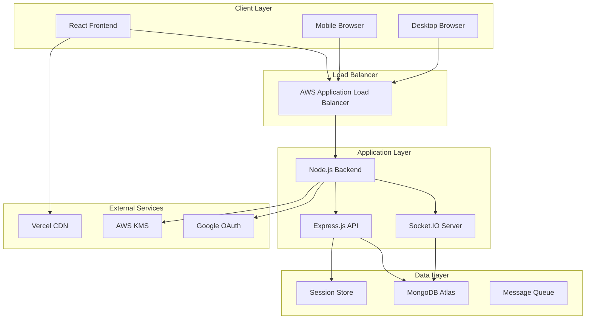
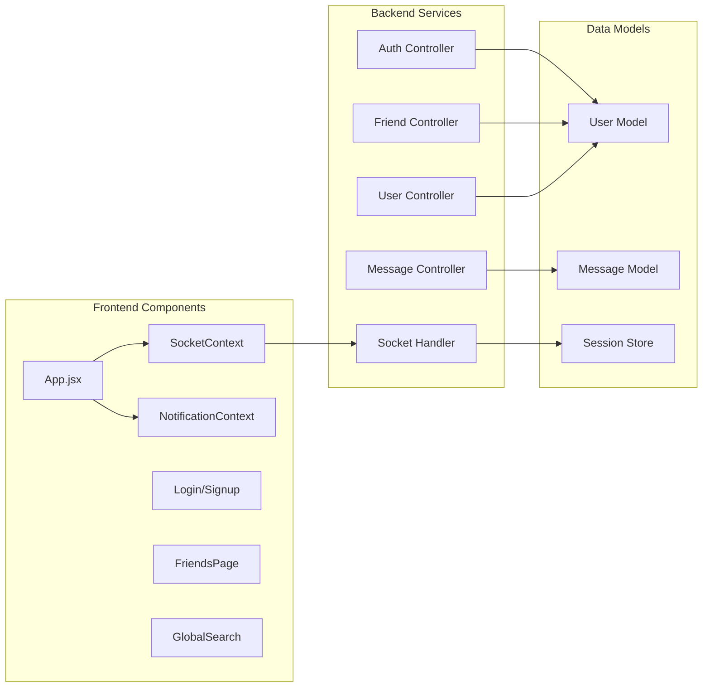
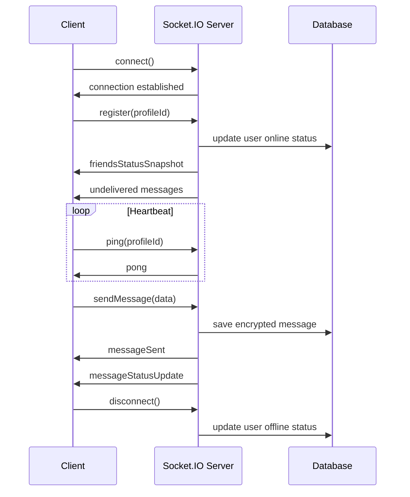
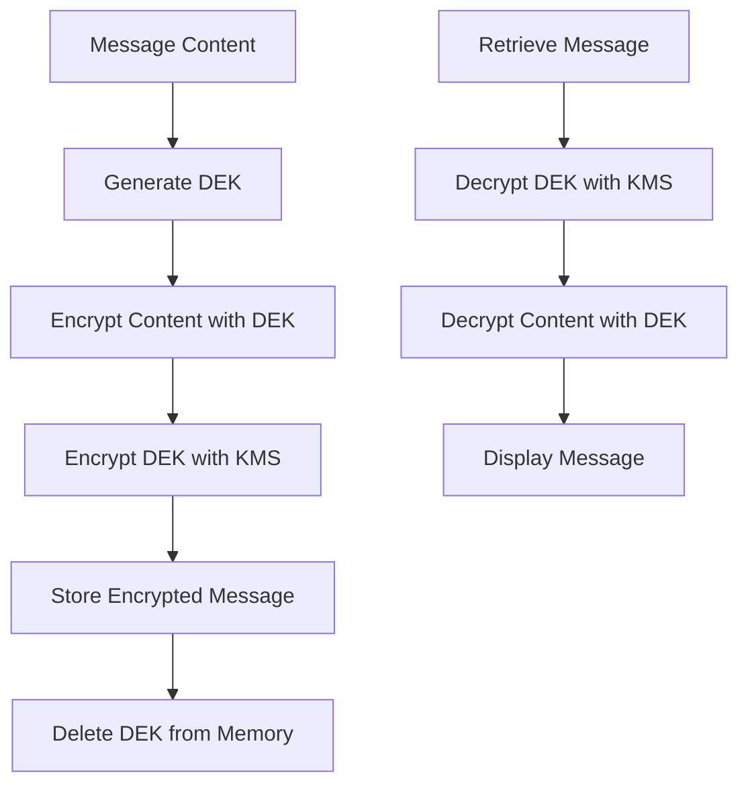
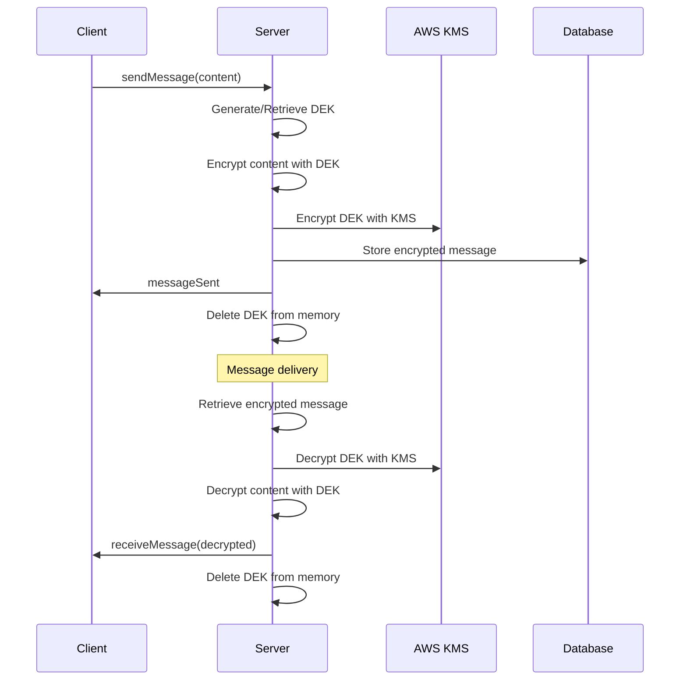
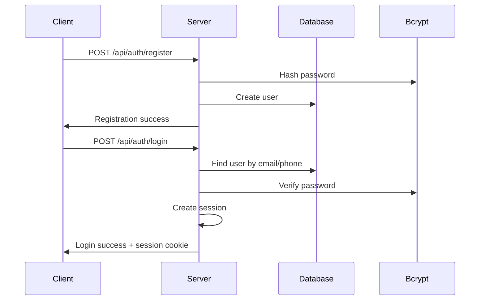
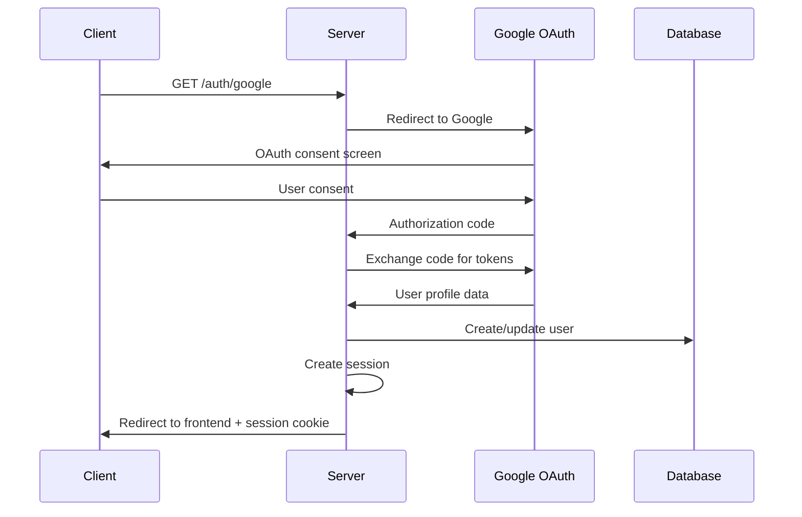
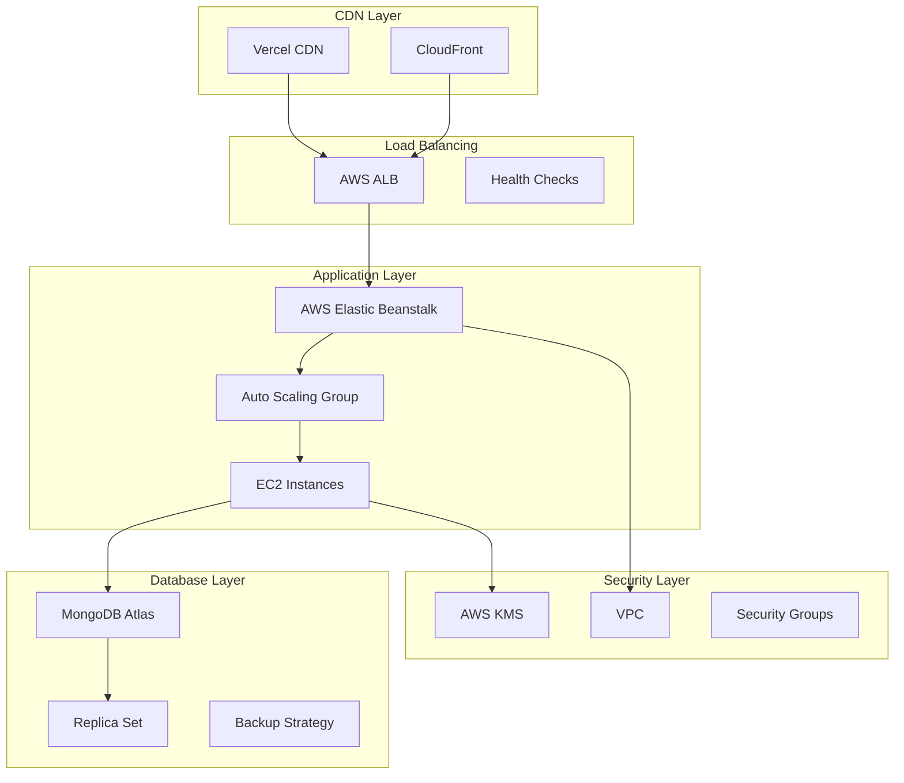

# 🐦 Sparrow Chat Application - Technical Documentation

## Table of Contents
1. [System Architecture](#system-architecture)
2. [Database Schema](#database-schema)
3. [API Documentation](#api-documentation)
4. [Real-time Communication](#real-time-communication)
5. [Security Implementation](#security-implementation)
6. [Encryption System](#encryption-system)
7. [Authentication Flow](#authentication-flow)
8. [Performance Optimizations](#performance-optimizations)
9. [Deployment Architecture](#deployment-architecture)
10. [Monitoring & Logging](#monitoring--logging)

---

## System Architecture

### High-Level Architecture



### Component Architecture



---

## Database Schema

### User Collection Schema

```javascript
{
  _id: ObjectId,
  fullName: String,
  email: String (unique, sparse),
  phoneNumber: String (unique, sparse),
  password: String (bcrypt hashed),
  profileId: String (unique, required),
  username: String (unique, required),
  friends: [String], // Array of profileIds
  friendRequests: [{
    fromUserId: String,
    status: String, // 'pending', 'accepted', 'rejected'
    timestamp: Date
  }],
  isOnline: Boolean,
  lastSeen: Date,
  socketId: String,
  profileImage: String,
  accountCreationDate: Date,
  loginAttempts: Number,
  lockUntil: Date,
  lastLoginAttempt: Date,
  passwordChangedAt: Date,
  needsUsernameSetup: Boolean
}
```

### Message Collection Schema

```javascript
{
  _id: ObjectId,
  senderId: String,
  receiverId: String,
  timestamp: Date,
  status: String, // 'sent', 'delivered', 'read'
  deliveredAt: Date,
  readAt: Date,
  
  // Legacy content field (for non-encrypted messages)
  content: String,
  
  // Encryption metadata
  isEncrypted: Boolean,
  encryptionVersion: String,
  
  // Encrypted message fields
  encryptedContent: String,
  iv: String,
  authTag: String,
  algorithm: String,
  
  // KMS envelope encryption fields
  encryptedDEK: Buffer,
  keyId: String,
  encryptionContext: Object,
  sessionId: String,
  
  // Additional metadata
  messageType: String, // 'text', 'image', 'file', 'system'
  metadata: Object,
  
  // Timestamps
  createdAt: Date,
  updatedAt: Date
}
```

### Indexes

```javascript
// User Collection Indexes
db.users.createIndex({ "profileId": 1 }, { unique: true })
db.users.createIndex({ "email": 1 }, { unique: true, sparse: true })
db.users.createIndex({ "phoneNumber": 1 }, { unique: true, sparse: true })
db.users.createIndex({ "username": 1 }, { unique: true })
db.users.createIndex({ "isOnline": 1 })
db.users.createIndex({ "lastSeen": -1 })

// Message Collection Indexes
db.messages.createIndex({ "senderId": 1, "receiverId": 1, "timestamp": -1 })
db.messages.createIndex({ "receiverId": 1, "status": 1 })
db.messages.createIndex({ "timestamp": -1 })
db.messages.createIndex({ "isEncrypted": 1 })
db.messages.createIndex({ "sessionId": 1 })
```

---

## API Documentation

### Authentication Endpoints

#### POST /api/auth/register
Register a new user with email/phone and password.

**Request Body:**
```json
{
  "email": "user@example.com",
  "phoneNumber": "+1234567890",
  "password": "securePassword123",
  "fullName": "John Doe"
}
```

**Response:**
```json
{
  "success": true,
  "message": "User registered successfully",
  "user": {
    "profileId": "uuid",
    "username": "generated_username",
    "email": "user@example.com",
    "fullName": "John Doe"
  }
}
```

#### POST /api/auth/login
Authenticate user with email/phone and password.

**Request Body:**
```json
{
  "email": "user@example.com",
  "password": "securePassword123"
}
```

**Response:**
```json
{
  "success": true,
  "message": "Login successful",
  "user": {
    "profileId": "uuid",
    "username": "username",
    "email": "user@example.com",
    "fullName": "John Doe",
    "profileImage": "image_url"
  }
}
```

#### GET /auth/google
Initiate Google OAuth flow.

**Response:** Redirects to Google OAuth consent screen.

#### GET /auth/logout
Logout user and clear session.

**Response:**
```json
{
  "success": true,
  "message": "Logged out successfully"
}
```

### User Management Endpoints

#### GET /api/user
Get current user profile (requires authentication).

**Response:**
```json
{
  "success": true,
  "user": {
    "profileId": "uuid",
    "username": "username",
    "email": "user@example.com",
    "fullName": "John Doe",
    "profileImage": "image_url",
    "isOnline": true,
    "lastSeen": "2024-01-01T00:00:00.000Z"
  }
}
```

#### PUT /api/user
Update user profile.

**Request Body:**
```json
{
  "username": "new_username",
  "fullName": "New Name",
  "profileImage": "new_image_url"
}
```

### Friend Management Endpoints

#### GET /api/friends
Get user's friends list.

**Response:**
```json
{
  "success": true,
  "friends": [
    {
      "profileId": "friend_uuid",
      "username": "friend_username",
      "fullName": "Friend Name",
      "profileImage": "image_url",
      "isOnline": true,
      "lastSeen": "2024-01-01T00:00:00.000Z"
    }
  ]
}
```

#### POST /api/friends/request
Send friend request.

**Request Body:**
```json
{
  "targetUserId": "target_profile_id"
}
```

#### PUT /api/friends/accept
Accept friend request.

**Request Body:**
```json
{
  "requestId": "request_id"
}
```

### Message Endpoints

#### GET /api/messages/:friendId
Get messages with a specific friend.

**Response:**
```json
{
  "success": true,
  "messages": [
    {
      "_id": "message_id",
      "senderId": "sender_id",
      "receiverId": "receiver_id",
      "content": "Message content",
      "timestamp": "2024-01-01T00:00:00.000Z",
      "status": "read",
      "isEncrypted": false
    }
  ]
}
```

#### POST /api/messages
Send a message.

**Request Body:**
```json
{
  "receiverId": "receiver_id",
  "content": "Message content"
}
```

---

## Real-time Communication

### Socket.IO Events

#### Client to Server Events

```javascript
// Register user with socket
socket.emit('register', profileId);

// Send message
socket.emit('sendMessage', {
  senderId: 'sender_id',
  receiverId: 'receiver_id',
  content: 'Message content'
});

// Mark messages as read
socket.emit('markMessagesAsRead', {
  senderId: 'sender_id',
  receiverId: 'receiver_id'
});

// Heartbeat/ping
socket.emit('ping', profileId);

// Logout
socket.emit('logout', { profileId: 'user_id' });
```

#### Server to Client Events

```javascript
// Receive message
socket.on('receiveMessage', (message) => {
  // Handle incoming message
});

// Message notification
socket.on('messageReceivedNotification', (notification) => {
  // Handle message notification
});

// Friend online status
socket.on('friendOnlineStatus', (status) => {
  // Handle friend online/offline status
});

// Message status update
socket.on('messageStatusUpdate', (update) => {
  // Handle message status (sent, delivered, read)
});

// Friends status snapshot
socket.on('friendsStatusSnapshot', (snapshot) => {
  // Handle initial friends status on connect
});
```

### Connection Management



---

## Security Implementation

### Authentication Security

1. **Session-based Authentication**
   - HttpOnly cookies for session storage
   - Secure flag for HTTPS
   - SameSite protection against CSRF
   - Session rotation on sensitive operations

2. **Password Security**
   - Bcrypt hashing with salt rounds
   - Password strength validation
   - Account lockout after failed attempts
   - Password change tracking

3. **OAuth Security**
   - OpenID Connect implementation
   - State parameter validation
   - PKCE (Proof Key for Code Exchange)
   - Secure token exchange

### CORS Configuration

```javascript
const allowedOrigins = [
  process.env.FRONTEND_URL || 'http://localhost:3000',
  'https://www.sparrowchat.in',
  'https://sparrowchat.in',
  'https://api.sparrowchat.in',
  'https://sparrow-frontend-sigma.vercel.app'
];

app.use(cors({
  origin: (origin, callback) => {
    if (!origin) return callback(null, true);
    if (allowedOrigins.includes(origin)) {
      callback(null, true);
    } else if (origin.endsWith('.vercel.app')) {
      callback(null, true);
    } else {
      callback(new Error('Not allowed by CORS'));
    }
  },
  credentials: true,
  methods: ['GET', 'POST', 'PUT', 'DELETE', 'OPTIONS'],
  allowedHeaders: ['Content-Type', 'Authorization', 'x-auth-token'],
  optionsSuccessStatus: 200
}));
```

### Rate Limiting

```javascript
const rateLimit = require('express-rate-limit');

const authLimiter = rateLimit({
  windowMs: 15 * 60 * 1000, // 15 minutes
  max: 5, // limit each IP to 5 requests per windowMs
  message: 'Too many authentication attempts, please try again later.',
  standardHeaders: true,
  legacyHeaders: false,
});

app.use('/api/auth', authLimiter);
```

---

## Encryption System

### KMS Envelope Encryption

The application uses AWS KMS for envelope encryption of messages:



### Encryption Implementation

```javascript
class OptimizedKMSEnvelopeEncryption {
  constructor(options = {}) {
    this.dekRotationInterval = options.dekRotationInterval || 30 * 60 * 1000;
    this.dekMaxAge = options.dekMaxAge || 60 * 60 * 1000;
    this.batchTimeout = options.batchTimeout || 50;
    this.batchSize = options.batchSize || 10;
    this.dekCache = new Map();
    this.batchQueue = [];
  }

  async encryptMessage(content, sessionId) {
    const dek = await this.getOrCreateDEK(sessionId);
    const iv = crypto.randomBytes(12);
    const cipher = crypto.createCipher('aes-256-gcm', dek);
    cipher.setAAD(Buffer.from(sessionId));
    
    let encrypted = cipher.update(content, 'utf8', 'hex');
    encrypted += cipher.final('hex');
    const authTag = cipher.getAuthTag();
    
    const encryptedDEK = await this.encryptDEK(dek, sessionId);
    
    return {
      encryptedContent: encrypted,
      iv: iv.toString('hex'),
      authTag: authTag.toString('hex'),
      encryptedDEK: encryptedDEK,
      keyId: this.getKeyId(sessionId),
      algorithm: 'aes-256-gcm'
    };
  }

  async decryptMessage(encryptedMessage, sessionId) {
    const dek = await this.decryptDEK(encryptedMessage.encryptedDEK, sessionId);
    const decipher = crypto.createDecipher('aes-256-gcm', dek);
    decipher.setAAD(Buffer.from(sessionId));
    decipher.setAuthTag(Buffer.from(encryptedMessage.authTag, 'hex'));
    
    let decrypted = decipher.update(encryptedMessage.encryptedContent, 'hex', 'utf8');
    decrypted += decipher.final('utf8');
    
    return decrypted;
  }
}
```

### Message Encryption Flow



---

## Authentication Flow

### Email/Phone Authentication



### Google OAuth Flow



### Session Management

```javascript
const sessionConfig = {
  name: 'sparrow.sid.v2',
  secret: process.env.SESSION_SECRET,
  resave: false,
  saveUninitialized: false,
  store: MongoStore.create({
    mongoUrl: process.env.MONGO_URI,
    collectionName: 'sessions',
    ttl: 14 * 24 * 60 * 60 // 14 days
  }),
  proxy: true,
  rolling: true,
  cookie: {
    domain: process.env.NODE_ENV === 'production' ? '.sparrowchat.in' : undefined,
    path: '/',
    maxAge: 7 * 24 * 60 * 60 * 1000, // 7 days
    httpOnly: process.env.NODE_ENV === 'production',
    secure: process.env.NODE_ENV === 'production',
    sameSite: process.env.NODE_ENV === 'production' ? 'none' : 'lax'
  }
};
```

---

## Performance Optimizations

### Database Optimizations

1. **Indexing Strategy**
   - Compound indexes for common queries
   - Sparse indexes for optional fields
   - TTL indexes for session cleanup

2. **Query Optimization**
   - Projection to limit returned fields
   - Pagination for large datasets
   - Aggregation pipelines for complex queries

3. **Connection Pooling**
   ```javascript
   mongoose.connect(mongoURI, {
     maxPoolSize: 10,
     serverSelectionTimeoutMS: 5000,
     socketTimeoutMS: 45000,
     bufferCommands: false,
     bufferMaxEntries: 0
   });
   ```

### Socket.IO Optimizations

1. **Connection Management**
   - Heartbeat mechanism for connection health
   - Automatic cleanup of stale connections
   - Connection pooling for multiple users

2. **Message Batching**
   - Batch multiple messages for efficiency
   - Debounced status updates
   - Optimized event emission

3. **Memory Management**
   - DEK caching with TTL
   - Automatic cleanup of old sessions
   - Garbage collection optimization

### Frontend Optimizations

1. **React Optimizations**
   - Context API for state management
   - Memoization for expensive components
   - Lazy loading for route components

2. **Socket Management**
   - Single socket instance per app
   - Automatic reconnection logic
   - Event debouncing

---

## Deployment Architecture

### Production Environment



### Environment Configuration

#### Backend Environment Variables
```bash
NODE_ENV=production
PORT=5000
MONGO_URI=mongodb+srv://...
SESSION_SECRET=your-super-secret-key
GOOGLE_CLIENT_ID=your-google-client-id
GOOGLE_CLIENT_SECRET=your-google-client-secret
AWS_ACCESS_KEY_ID=your-aws-access-key
AWS_SECRET_ACCESS_KEY=your-aws-secret-key
AWS_REGION=us-east-1
KMS_KEY_ID=your-kms-key-id
```

#### Frontend Environment Variables
```bash
REACT_APP_BACKEND_URL=https://api.sparrowchat.in
REACT_APP_GOOGLE_CLIENT_ID=your-google-client-id
```

### Deployment Process

1. **Backend Deployment (AWS EB)**
   ```bash
   # Create deployment package
   zip -r sparrow-backend-deploy.zip . -x node_modules/\*
   
   # Deploy to Elastic Beanstalk
   eb deploy production
   ```

2. **Frontend Deployment (Vercel)**
   ```bash
   # Automatic deployment on git push
   git push origin main
   ```

3. **Database Migration**
   ```bash
   # Run database migrations
   npm run migrate
   ```

---

## Monitoring & Logging

### Application Logging

```javascript
const logWithTimestamp = {
  log: (...args) => console.log(`[${new Date().toISOString()}]`, ...args),
  error: (...args) => console.error(`[${new Date().toISOString()}]`, ...args),
  warn: (...args) => console.warn(`[${new Date().toISOString()}]`, ...args),
  info: (...args) => console.info(`[${new Date().toISOString()}]`, ...args),
  debug: (...args) => console.debug(`[${new Date().toISOString()}]`, ...args)
};
```

### Performance Monitoring

1. **Database Metrics**
   - Query execution time
   - Connection pool usage
   - Index utilization

2. **Application Metrics**
   - Response times
   - Error rates
   - Memory usage
   - CPU utilization

3. **Socket.IO Metrics**
   - Connection count
   - Message throughput
   - Event processing time

### Error Handling

```javascript
// Global error handler
process.on('uncaughtException', (error) => {
  console.error('Uncaught Exception:', error);
  process.exit(1);
});

process.on('unhandledRejection', (reason, promise) => {
  console.error('Unhandled Rejection at:', promise, 'reason:', reason);
});

// Socket error handling
socket.on('error', (error) => {
  console.error('Socket error:', error);
});
```

### Health Checks

```javascript
app.get('/health', (req, res) => {
  res.json({
    status: 'healthy',
    timestamp: new Date().toISOString(),
    uptime: process.uptime(),
    memory: process.memoryUsage(),
    version: process.env.npm_package_version
  });
});
```

---

## Security Best Practices

### Data Protection

1. **Encryption at Rest**
   - MongoDB encryption
   - KMS key management
   - Secure key rotation

2. **Encryption in Transit**
   - TLS 1.3 for all communications
   - Certificate pinning
   - Secure WebSocket connections

3. **Data Minimization**
   - Delete messages after delivery
   - Minimal data retention
   - User data export/deletion

### Access Control

1. **Authentication**
   - Multi-factor authentication support
   - Session management
   - Account lockout policies

2. **Authorization**
   - Role-based access control
   - Resource-level permissions
   - API rate limiting

### Compliance

1. **GDPR Compliance**
   - Data portability
   - Right to deletion
   - Consent management

2. **Security Auditing**
   - Access logging
   - Security event monitoring
   - Regular security assessments

---

This technical documentation provides a comprehensive overview of the Sparrow chat application's architecture, implementation details, and security measures. It serves as a reference for developers, system administrators, and security professionals working with the application.
